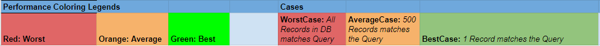
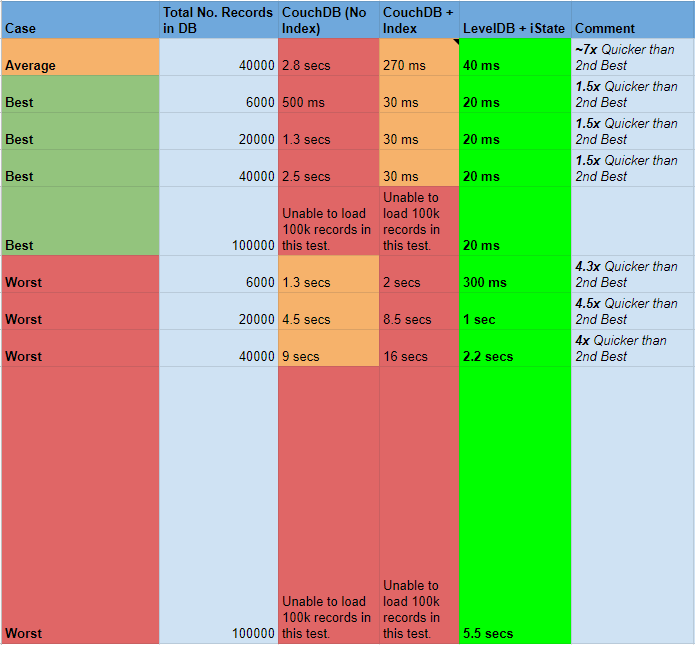

## iState [](https://godoc.org/github.com/motoreq/istate) [](https://goreportcard.com/report/github.com/motoreq/istate) [](https://travis-ci.com/motoreq/istate)


iState is a state management package for Hyperledger fabric chaincode. It can be used to perform high performance rich queries on leveldb.

### Features

* Rich Query in levelDB.

* On an average case, query is **~7 times** faster than CouchDB's Rich Query with Index enabled.

* In-memory caching using ARC (Adaptive Replacement Cache) algorithm.

* Cache consistency is maintained. Data returned by query is always consistent.

* Easy to use.

### Performance Chart 

[Follow the discussion on internal working mechanisms in Hyperledger Lists](https://lists.hyperledger.org/g/fabric/topic/73089062?p=Created,,,20,2,0,0)

[Full Chart Link](https://docs.google.com/spreadsheets/d/1f3MenLWoq75ss5IvDJnGP3A30x1BqJLVVcQi7KEURt8/edit#gid=1695504678) 





### Releases

- [v1.0.2 - May 11, 2020](https://github.com/motoreq/istate/releases/tag/v1.0.2)
- [v1.0.1 - April 24, 2020](https://github.com/motoreq/istate/releases/tag/v1.0.1)
- [v1.0 - April 17, 2020](https://github.com/motoreq/istate/releases/tag/v1.0)

### Installation

#### Using go mod

* Initialize go.mod file in the chaincode directory using ```go mod init```
* Get the shim package 
	
	```go get github.com/hyperledger/fabric/core/chaincode/shim@release-1.4```
* Add ```github.com/motoreq/istate``` to import statement

That's all, istate is ready to be used in the chaincode.

* **Get Vendor Folder** (necessary only for fabric **v1.x**) 

	```go mod vendor```


### Example

#### Adding tags to struct

The following tags must be added only to the struct types which is getting stored in state db.

- ```primary``` tag is used to denote the primary key / id in the struct. This field **must** contain universal unique value and is handled externally.
- ```istate``` tag is used to denote the fields that is allowed to be queried. It is recommended to add this tag to all fields.
- Value of ```istate``` tag must be universally unique with other structs in the chaincode. Recommended format: ```<structname>_<fieldname>```

```go
type TestStruct struct {
	ID      string  `json:"id" istate:"TestStruct_id" primary:"true"`
	AString string  `json:"aString" istate:"TestStruct_aString"`
	AnInt   int64   `json:"anInt" istate:"TestStruct_anInt"`
}
```

#### Init

- Init involves getting a new iState Interface for your struct type using ```istate.NewiState()``` function. It takes the empty struct value and ```istate.Options``` as input params. ```CacheSize``` in ```istate.Options``` indicate the maximum number of records that can be available in memory.
- The returned ```istate.Interface``` can be stored as a field in main ```SmartContract``` struct. 
- This interface can then be used to interact with iState package for performing CRUD or Query operation with this struct type (```TestStruct```) further along.

```go
package main 

import (
  "github.com/motoreq/istate"
  "github.com/hyperledger/fabric/core/chaincode/shim"
  pb "github.com/hyperledger/fabric/protos/peer"
)

type TestSmartContract struct {
	TestStructiState istate.Interface
}

// Init initializes chaincode.
func (sc *TestSmartContract) Init(stub shim.ChaincodeStubInterface) pb.Response {
	err := sc.init()
	if err != nil {
		return shim.Error(err.Error())
	}
	return shim.Success(nil)
}

func (sc *TestSmartContract) init() error {
	iStateOpt := istate.Options{
		CacheSize: 1000000,
	}
	
	TestStructiState, err := istate.NewiState(TestStruct{}, iStateOpt)
	if err != nil {
		return err
	}
	
	sc.TestStructiState = TestStructiState
	
	return nil
}
```

#### Create State

```go
func (sc *TestSmartContract) CreateState(stub shim.ChaincodeStubInterface) pb.Response {
	var err error
	
	testStruct := TestStruct{
		ID:      "unique_id_1",
		AString: "John Doe",
		AnInt:   100,
	}	
	
	err = sc.TestStructiState.CreateState(stub, testStruct)
	if err != nil {
		return shim.Error(err.Error())
	}
	
	output := fmt.Sprintf("Successfully saved: %v", testStruct)
	return shim.Success([]byte(output))
}
```

#### Read State

```go
func (sc *TestSmartContract) ReadState(stub shim.ChaincodeStubInterface) pb.Response {
	var err error

	stateInterface, err := sc.TestStructiState.ReadState(stub, "unique_id_1")
	if err != nil {
		return shim.Error(err.Error())
	}
	
	actualState := stateInterface.(TestStruct)
	fmt.Println("AString: ", actualState.AString)
	
	return shim.Success(nil)

}
```

#### Update State

```go
func (sc *TestSmartContract) UpdateState(stub shim.ChaincodeStubInterface) pb.Response {
	var err error
	
	testStruct := TestStruct{
		ID:      "unique_id_1",
		AString: "John Doe Jr.",
		AnInt:   200,
	}	
	
	err = sc.TestStructiState.UpdateState(stub, testStruct)
	if err != nil {
		return shim.Error(err.Error())
	}
	
	output := fmt.Sprintf("Successfully updated: %v", testStruct)
	return shim.Success([]byte(output))
}
```

#### Delete State

```go
func (sc *TestSmartContract) DeleteState(stub shim.ChaincodeStubInterface) pb.Response {
	var err error
	
	err = sc.TestStructiState.DeleteState(stub, "unique_id_1")
	if err != nil {
		return shim.Error(err.Error())
	}
	
	output := fmt.Sprintf("Successfully deleted: %v", "unique_id_1")
	return shim.Success([]byte(output))
}
```

#### Query

```go
func (sc *TestSmartContract) Query(stub shim.ChaincodeStubInterface) pb.Response {
	var err error
	
	queryString := `[{"anInt": "eq 200"}]`
	
	isInvoke := false	
	
	// Important! isInvoke must be set to true, when Query is used for a invoke/write transaction.
	// It is not recommended to use Query during invoke transaction, when query results returned is 
	// greater than 100 in number. 
	// The more the query results, the slower it will be to fetch when using isInvoke=true.
	
	stateSliceInterface, err := sc.TestStructiState.Query(stub, queryString, isInvoke)
	if err != nil {
		return shim.Error(err.Error())
	}
	
	result := stateSliceInterface.([]TestStruct)
	for i := 0; i < len(result); i ++ {
		fmt.Println("ID: ", result[i].ID, "AString:", result[i].AString)
	}
	
	return shim.Success(nil)

}
```

### Query Syntax

Reference Struct: 
```go
struct TestStruct type {
	ID      	string   		`json:"id" istate:"TestStruct_id" primary:"true"`
	AString 	string   		`json:"aString" istate:"TestStruct_aString"`
	AnInt   	int64    		`json:"anInt" istate:"TestStruct_anInt"`
	ASlice  	[]string 		`json:"aSlice" istate:"TestStruct_aSlice"` 
	AMap    	map[string]string 	`json:"aMap" istate:"TestStruct_aMap"`
	ANestedStruct	SomeStruct		`json:"aNestedStruct" istate:"TestStruct_aNestedStruct"`
}

struct SomeStruct type {
	NestedString 	string `json:"nestedString"`
}
```
***Note: json tag must be present in all fields (including nested structs), istate tag is not necessary to be included in nested structs. iState will index nested structs and make it available for query automatically, if the parent struct field has istate tag.***

- The base syntax of query is similar to that of a JSON array of objects ````[{"fieldname": "<operation> <value>"}]````.
***Note: The fieldname in query should match the value of json tag in respective field and not the go struct's fieldname***

- For nested structs, dot notation can be used. Eg: ````[{"aNestedStruct.nestedString": "eq awesome string"}]````

- To search for elements in an array / slice, ````.*```` notation can be used. 
Eg:  ````[{"aSlice.*": "eq one of awesome strings"}]```` 
***Note: ```*``` can be used to fill a depth in a nested fieldname, if that depth represents a collection type such as array/slice/map***

- To search for a map's key, Eg:  ````[{"aMap": "eq  mapkey"}]````

- To search for map's value when key is not known, Eg: ````[{"aMap.*": "eq  map value"}]````

- To search for a map's value when key is known, Eg: ````[{"aMap.mapkey": "eq  map value"}]````

- To perform complex queries on a single field, ```cmplx``` syntax can be used. Eg: ````[{"anInt": "cmplx and(gt 100, lt 500)"}]````. Refer **Complex Queries** section below for more info.

- To perform ````or```` operation between two query sets, simply append the query array with another object. Eg: ````[{"anInt": "eq 100", "aSlice.*": "eq 1"}, {"anInt": "eq 100", "aMap.*": "eq 1"}]````.
The relationship between two or more query objects inside the query array is always ````or````. To perform ````and````, ````cmplx```` syntax can be used per field.

#### Queries on Collection type such as Array/Slice/Map

- To match all elements of collection, ````^```` can be prefixed to the operator. 

- Eg: All elements equal to ````[{"aSlice.*": "^eq awesome string"}]```` 

- Eg: None of the elements equal to ````[{"aSlice.*": "^neq awesome string"}]````
***Note:````neq```` without ````^```` prefix will mean "atleast one element is not equal to."***

- Eg: Atleast one element equal to ````[{"aSlice.*": "eq awesome string"}]```` 

#### Primitive Queries

##### Equal to (==)

- ```[{"anInt": "eq 500"}]```

##### Not Equal to (!=)

- ```[{"anInt": "neq 500"}]```

##### Greater than (>)

- ```[{"anInt": "gt 500"}]```

##### Less than (<)

- ```[{"anInt": "lt 500"}]```

##### Greater than or Equal (>=)

- ```[{"anInt": "gte 500"}]```

##### Less than or Equal (<=)

- ```[{"anInt": "lte 500"}]```

#### Match all Queries

##### Equal to (==)

- ```[{"aSlice.*": "^eq 500"}]```

##### Not Equal to (!=)

- ```[{"aSlice.*": "^neq 500"}]```

##### Greater than (>)

- ```[{"aSlice.*": "^gt 500"}]```

##### Less than (<)

- ```[{"aSlice.*": "^lt 500"}]```

##### Greater than or Equal (>=)

- ```[{"aSlice.*": "^gte 500"}]```

##### Less than or Equal (<=)

- ```[{"aSlice.*": "^lte 500"}]```

#### Complex Queries

- The syntax for complex field queries is as follows: ````cmplx <operator>(<query 1>, <query 2>, ... <query n>)````

- The queries enclosed by the operator can also be another complex query. Eg: ````cmplx or(and(gt 7, lt 10), lt 5)````

- ````cmplx```` syntax supports two logical operators. 
	- ````and````
	- ````or````
	
##### Example

- ````[{"aSlice.*":"cmplx or(and(or(^eq 200, eq -102), ^gt -105), eq 0)", "id":"cmplx or(and(lt test100, gte test1), neq test11)"}]````

### Restrictions:
- Cannot use type ```"interface{}"``` as field type.
- Cannot use type ```"[]byte"``` as field type. Instead, ```string``` can be used. 
- Cannot use the following ascii characters in the struct names or field values:
	- ```"\000"```
	- ```"\001"```
	- ```"\002"```
	- ```"~"``` (or) ```"\176"```
	- ```"\177"```
- Cannot use these in struct field names:
	- ```"."```
	- ``` "*"```
	- ```".docType"```
	- ```".keyref"```
	- ```".value"```
	- ```".fieldName"```
	- (For future) It is good to avoid having field names starting with ```"."``` in the structs
	
### Useful Peer container ENV

- ```CORE_LEDGER_STATE_TOTALQUERYLIMIT=1000000```
- ```CORE_VM_DOCKER_HOSTCONFIG_MEMORY=5368709120```

### Reference

`godoc` or https://godoc.org/github.com/motoreq/istate

## License <a name="license"></a>

iState Project source code files are made available under the Apache License, Version 2.0 (Apache-2.0), located in the [LICENSE](LICENSE) file. 
